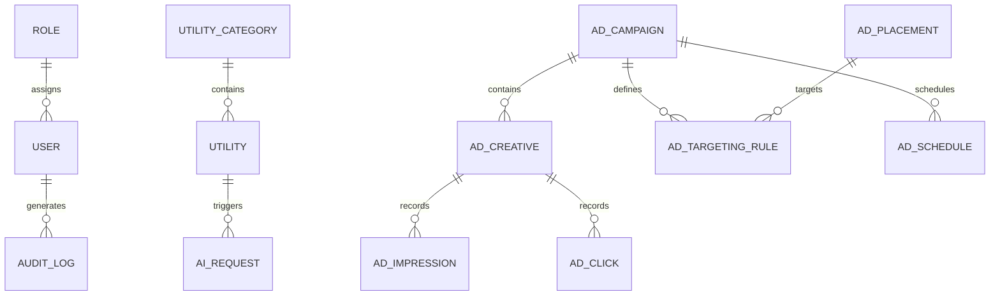

# Database Schema Specification

## 1. Overview
The database architecture uses PostgreSQL 16 managed via Prisma ORM. The relational model enforces strict foreign keys, indexes on high-frequency query targets (slugs, placements, campaigns, targeting attributes), and soft deletion support.

---

## 2. Entity Diagram & Relationships

---

## 3. Core Database Entities

### A. Authentication & RBAC
- `User`: Admin credentials, email, password hash, role ID, status.
- `Role`: System roles (`SUPER_ADMIN`, `ADMIN`, `EDITOR`, `ANALYST`).
- `Permission`: Granular permissions mapped to roles.

### B. Utilities Registry
- `Utility`: `id`, `slug` (unique index), `name`, `categoryId`, `implementationType` (`LOCAL`, `SERVER`, `OPENAI`), `requiresAI`, `status` (`DRAFT`, `ACTIVE`, `DISABLED`), `seoTitle`, `seoDescription`, `config` (JSON), `createdAt`, `updatedAt`.
- `UtilityCategory`: `id`, `slug` (unique index), `name`, `description`.

### C. Ad Engine Entities
- `AdCampaign`: `id`, `name`, `status` (`DRAFT`, `SCHEDULED`, `ACTIVE`, `PAUSED`, `EXPIRED`), `priority` (Int, e.g. 100, 80, 50), `weight` (Int, for rotation), `dailyCap`, `totalCap`, `startDate`, `endDate`.
- `AdCreative`: `id`, `campaignId`, `type` (`IMAGE`, `VIDEO`, `HTML`, `IFRAME`), `mediaUrl`, `targetUrl`, `width`, `height`, `altText`, `customHtml`.
- `AdPlacement`: `id`, `code` (e.g. `TOP_CONTENT`, `HEADER_BANNER`, `SIDEBAR`, `AFTER_TOOL`), `name`, `supportedTypes`.
- `AdTargetingRule`: `id`, `campaignId`, `placementId`, `deviceTypes` (`MOBILE`, `TABLET`, `DESKTOP`), `utilityIds` (String array or relation), `categoryIds` (String array), `countries`.
- `AdImpression`: `id`, `creativeId`, `placementId`, `utilitySlug`, `device`, `ipHash`, `userAgent`, `timestamp`.
- `AdClick`: `id`, `creativeId`, `placementId`, `utilitySlug`, `device`, `ipHash`, `timestamp`.

### D. AI & Analytics
- `AiRequest`: `id`, `utilitySlug`, `model`, `promptTokens`, `completionTokens`, `totalTokens`, `estimatedCost`, `status`, `durationMs`, `timestamp`.
- `AnalyticsEvent`: `id`, `eventType` (`page_view`, `tool_start`, `tool_complete`, `tool_error`), `utilitySlug`, `utmSource`, `utmMedium`, `utmCampaign`, `metadata` (JSON), `timestamp`.
