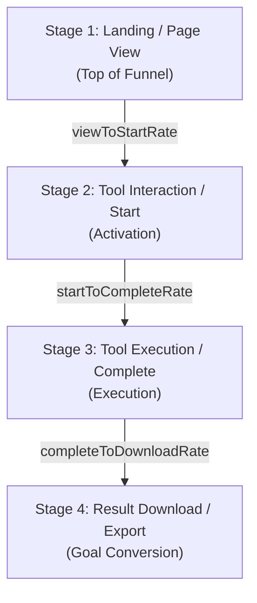

# Growth Analytics, Experimentation & Conversion Intelligence

## Overview

Phase 18 introduces the **Growth Decision Engine** to the Utility + Ad Platform. Rather than simply collecting isolated telemetry events, this system models the full user journey:
1. **Acquisition**: First-touch attribution from UTM parameters (`utm_source`, `utm_medium`, `utm_campaign`).
2. **Funnel Intelligence**: Step-by-step conversion tracking (`PAGE_VIEW` $\to$ `TOOL_START` $\to$ `TOOL_COMPLETE` $\to$ `RESULT_DOWNLOAD`) with stage drop-off rates.
3. **Utility Intelligence**: Granular completion, error, export, and duration metrics per utility and category.
4. **Ad Monetization Intelligence**: Impression volume, click volume, and CTR by placement, device, campaign, and creative.
5. **Deterministic Experimentation (A/B Testing)**: Reproducible session-hashed variant assignment, exposure telemetry (`EXPERIMENT_EXPOSURE`), and variant conversion rate measurement.

---

## 1. Funnel Intelligence Architecture

The platform conversion funnel measures user progression across four canonical stages:



### Stage Drop-Off Metrics
- **View to Start Rate**: $\frac{\text{Tool Starts}}{\text{Page Views}} \times 100\%$
- **Start to Complete Rate**: $\frac{\text{Tool Completions}}{\text{Tool Starts}} \times 100\%$
- **Complete to Download Rate**: $\frac{\text{Result Downloads}}{\text{Tool Completions}} \times 100\%$
- **End-to-End Conversion Rate**: $\frac{\text{Result Downloads}}{\text{Page Views}} \times 100\%$

All calculations include division-by-zero guards, returning 0% when upstream denominators are zero.

---

## 2. Acquisition & Attribution

- **Capture Mechanism**: SSR-safe URL search parameter parsing cached in browser `sessionStorage` (`ad_platform_utm_data`).
- **Attribution Fields**:
  - `utmSource`: Traffic origin (e.g. `google`, `twitter`, `newsletter`, `direct`).
  - `utmMedium`: Channel type (e.g. `cpc`, `social`, `email`).
  - `utmCampaign`: Marketing campaign identifier.
- **Privacy Assurance**: No IP addresses or personally identifiable information (PII) are captured or correlated.

---

## 3. Deterministic A/B Experimentation Framework

To prevent uncontrolled or random variant hopping between page reloads, experiment variant allocation uses a **32-bit FNV-1a deterministic hash** over `(experimentId + ":" + sessionToken)`.

```typescript
export function getExperimentVariant(
  experimentId: string,
  sessionToken: string,
  variants: Array<{ id: string; weight?: number }>,
): string
```

### Active Platform Experiments
1. `exp_cta_wording`: "Convert Now" vs "Start Free & Instant" on primary utility execution buttons.
2. `exp_workspace_layout`: Standard layout vs Compact focused layout for multi-step PDF/Image tools.
3. `exp_ad_placement_priority`: Standard ad hierarchy vs Sticky priority layout.

### Telemetry Lifecycle
```text
User Session
    ↓
Deterministic Variant Assignment (FNV-1a Hash)
    ↓
trackExperimentExposure(experimentId, variant)
    ↓
Downstream Conversion (TOOL_COMPLETE / RESULT_DOWNLOAD / AD_CLICK)
    ↓
Admin Growth Intelligence Aggregator (Variant Conversion Rate & Leader Detection)
```

---

## 4. Privacy & Performance Standards

1. **Zero Raw IP Persistence**: IP addresses and user agents are strictly SHA-256 hashed with salt or omitted.
2. **Zero Sensitive Payloads**: Utility inputs, raw documents, prompt texts, and outputs are never stored in telemetry events.
3. **Bounded Payloads**: Event metadata is strictly validated and capped at 5KB.
4. **SQL-Aggregated Queries**: Date-bounded queries (`timestamp >= cutoff`) grouped at PostgreSQL level to prevent large memory transfers to Node.js.
