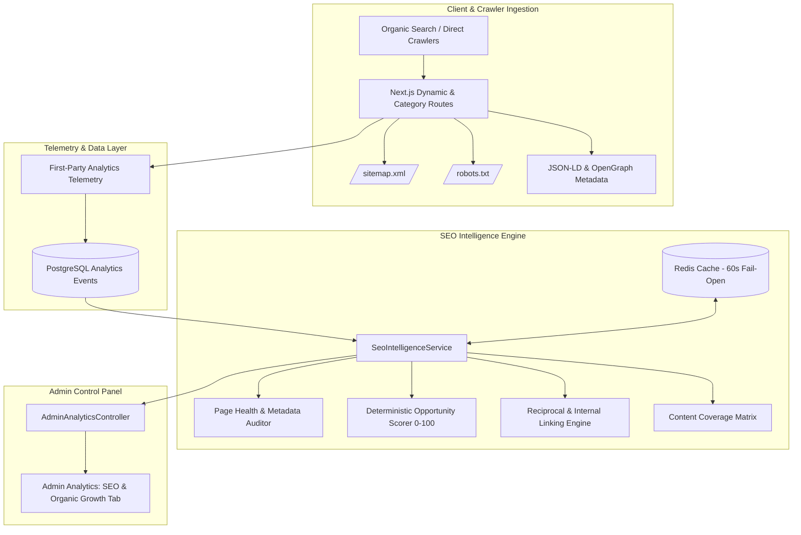

# SEO Content Intelligence, Programmatic Landing Pages & Organic Growth Engine

## Phase 22 Architecture & Implementation Specification

### 1. Architectural Overview

Phase 22 establishes an organic growth and SEO content intelligence layer for the utility+ad platform. It derives organic acquisition insights, evaluates on-page and technical SEO health, scores programmatic growth opportunities, and maps reciprocal internal linking workflows—without external SEO API dependencies or fabricated search metrics.

---

### 2. Core SEO Contracts & DTOs

All Phase 22 contracts are declared in `packages/shared/src/contracts/seo.ts`:

- `SeoOpportunityDto`: Deterministic growth opportunities scored 0–100 with explainable reasons and recommended actions.
- `SeoPageHealthDto`: Technical on-page audit for title, description length, canonical tags, OpenGraph, Twitter cards, JSON-LD, and breadcrumbs.
- `SeoInternalLinkOpportunityDto`: Reciprocal, same-category, and cross-category workflow recommendations.
- `OrganicAcquisitionDto`: First-party organic search and referral acquisition telemetry.
- `SeoUtilityPerformanceDto`: Utility-level organic traffic, tool starts, completions, downloads, and conversion rates.
- `SeoCategoryPerformanceDto`: Category-level landing page health, active utility count, and content coverage status (`COMPLETE`, `PARTIAL`, `NEEDS_REVIEW`).
- `SeoContentCoverageDto`: Platform-wide content completeness summary.
- `SeoHealthDto`: Composite 0–100 SEO health index with status (`HEALTHY`, `WARNING`, `CRITICAL`).
- `SeoIntelligenceDto`: Unified SEO analytics payload for the admin dashboard.

---

### 3. First-Party Organic Traffic Classification

Organic attribution is classified strictly using first-party telemetry events:
- `utmMedium` matching `organic` or `search`
- `utmSource` matching known organic search engines (`google`, `bing`, `duckduckgo`, `yahoo`, `ecosia`, `yandex`, `baidu`)
- `metadata.trafficType` matching `organic`

No third-party cookies, fingerprinting, or external search tracking scripts are used.

---

### 4. Deterministic 0–100 SEO Opportunity Scoring

The opportunity engine calculates a transparent, reproducible 0–100 score for utilities based on 4 observable signals:

$$\text{OpportunityScore} = \min\left(100, \text{Round}\left(\text{ConvStrength} + \text{DemandSignal} + \text{HealthGap} + \text{LinkGap}\right)\right)$$

Where:
- **Conversion Strength (35% weight)**: Measures utility completion rate ($\frac{\text{Completions}}{\text{Starts}} \times 35$).
- **Demand Signal (25% weight)**: Observed traffic volume bounded to 25 points ($\min\left(25, \frac{\text{PageViews}}{20} \times 25\right)$).
- **Health Gap (20% weight)**: Room for on-page SEO improvement ($\frac{100 - \text{HealthScore}}{100} \times 20$).
- **Internal Link Gap (20% weight)**: Boosts utilities with fewer than 3 contextual internal links (20 pts if $<3$, else 5 pts).

---

### 5. Deterministic Internal Linking Graph

Reciprocal utility pairs are mapped to guide visitors between natural multi-step workflows:
- `image-compressor` $\leftrightarrow$ `jpg-to-png`
- `png-to-jpg` $\leftrightarrow$ `image-compressor`
- `pdf-merge` $\leftrightarrow$ `pdf-split`
- `pdf-to-jpg` $\leftrightarrow$ `image-compressor`
- `json-formatter` $\leftrightarrow$ `base64-converter`
- `ai-humanizer` $\leftrightarrow$ `ai-grammar-checker`
- `ai-paraphraser` $\leftrightarrow$ `ai-humanizer`

---

### 6. Admin API Endpoints & RBAC Protection

| Method | Endpoint | Permission | Cache TTL | Description |
|---|---|---|---|---|
| `GET` | `/api/v1/admin/analytics/seo` | `analytics:read` | 60s fail-open | Unified SEO intelligence report |
| `GET` | `/api/v1/admin/analytics/seo/opportunities` | `analytics:read` | 60s fail-open | Prioritized SEO opportunity queue |
| `GET` | `/api/v1/admin/analytics/seo/page-health` | `analytics:read` | 60s fail-open | Page health & metadata completeness audit |
| `GET` | `/api/v1/admin/analytics/seo/internal-links` | `analytics:read` | 60s fail-open | Internal linking recommendations |
| `GET` | `/api/v1/admin/analytics/seo/content-coverage` | `analytics:read` | 60s fail-open | Content coverage matrix summary |

---

### 7. Strict Privacy & Boundaries

- **Zero Fabricated Metrics**: No fake Google search volume, keyword difficulty, or external ranking positions.
- **Privacy First**: Session tokens and IP hashes are strictly excluded from all SEO responses.
- **Fail-Open Reliability**: If Redis is unreachable, all SEO analytics queries execute directly against PostgreSQL without crashing.
- **Mock AI Mode Preserved**: `AI_PROVIDER=mock`, zero external OpenAI API calls, zero API keys required.
